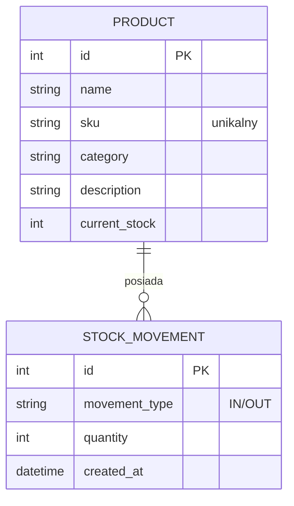

# System Zarządzania Magazynem

Zintegrowany system informatyczny usprawniający zarządzanie magazynem. Program umożliwia śledzenie produktów za pomocą unikalnych kodów SKU, rejestrację dostaw oraz wydań, a także integrację z systemem generowania kodów QR.

**🌍 Wersja LIVE (Render):** https://system-magazynowy.onrender.com/

## Wykorzystane technologie:
* **Backend:** Python 3.12 (wersja slim) / Django Framework
* **Baza danych:** SQLite (lokalnie) / PostgreSQL (produkcyjnie)
* **Konteneryzacja:** Docker
* **Infrastruktura CI/CD:** GitHub Actions -> Render 

## Kluczowe Funkcjonalności (Zrealizowane)
* Pełna obsługa CRUD dla produktów magazynowych i ruchów (Dostawy/Wydania).
* Automatyczne generowanie unikalnych kodów SKU na podstawie kategorii towaru.
* Dynamiczna integracja z zewnętrznym API (`api.qrserver.com`) generującym kody QR dla produktów.
* Zabezpieczenie konfiguracji zgodnie z architekturą 12-Factor App (zmienne środowiskowe).
* Pełna automatyzacja procesu wdrożenia (CI/CD) z weryfikacją testów.

## Architektura i Model Danych



## Instrukcja Uruchomienia

### Środowisko lokalne (Dla deweloperów)
1. Sklonuj repozytorium na swój komputer.
2. Utwórz i aktywuj środowisko wirtualne:

   ```BASH
   python -m venv venv

   source venv/bin/activate  # (Linux/Mac)

   venv\Scripts\activate     # (Windows)
   ```

3. Zainstaluj wymagane pakiety:
   `pip install -r requirements.txt`

4. Konfiguracja środowiska: Skopiuj plik szablonu .env.example, zmień jego nazwę na .env i uzupełnij własnym, bezpiecznym kluczem SECRET_KEY.

5. Wykonaj migracje bazy danych:
   `python manage.py migrate`

6. Uruchom serwer deweloperski:
   `python manage.py runserver`

### Uruchomienie w Dockerze (Opcjonalnie)
Upewnij się, że masz zainstalowanego Dockera. Z poziomu głównego katalogu projektu uruchom komendy:
```
   docker build -t system_magazynowy .
   docker run -p 8000:8000 --env-file .env system_magazynowy
```
Aplikacja będzie dostępna pod adresem: http://localhost:8000